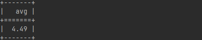
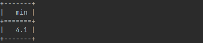
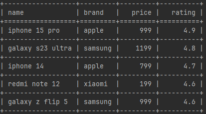

CLI-инструмент для фильтрации, агрегации и сортировки данных из CSV-файлов.

- Фильтрация (`--where`): по числовым и строковым колонкам с операторами `>`, `<`, `>=`, `<=`, `=`
- Агрегация (`--aggregate`): `avg`, `min`, `max` — только по числовым колонкам
- Сортировка (`--order-by`): по числовым или строковым колонкам в `asc` или `desc` порядке
___
- Для красивого вывода информации используется библиотека `tabulate`.
- Библиотеки `pytest` и `pytest-cov` используются для тестирования.

### Примеры запросов

`python main.py --file products.csv --aggregate "rating=avg"`

`python main.py --file products.csv --where "brand=xiaomi" --aggregate "rating=min"`

`python main.py --file products.csv --where "rating>4.5" --order-by "rating=desc"`

### Тестирование

`pytest --cov=main test_main.py`
